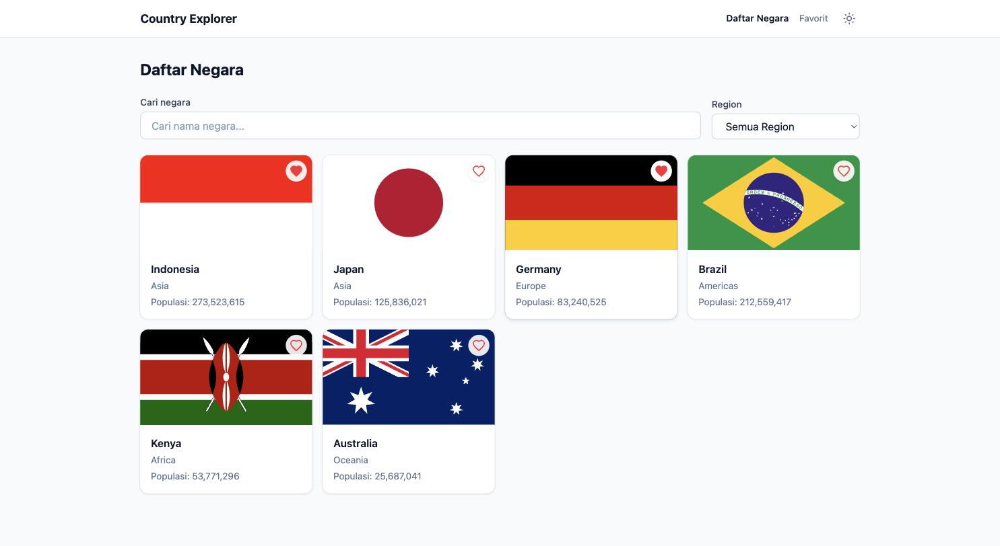
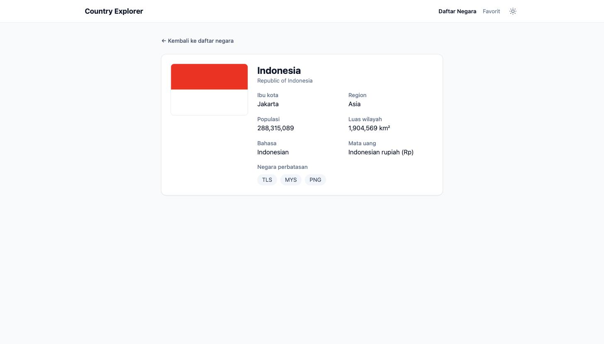
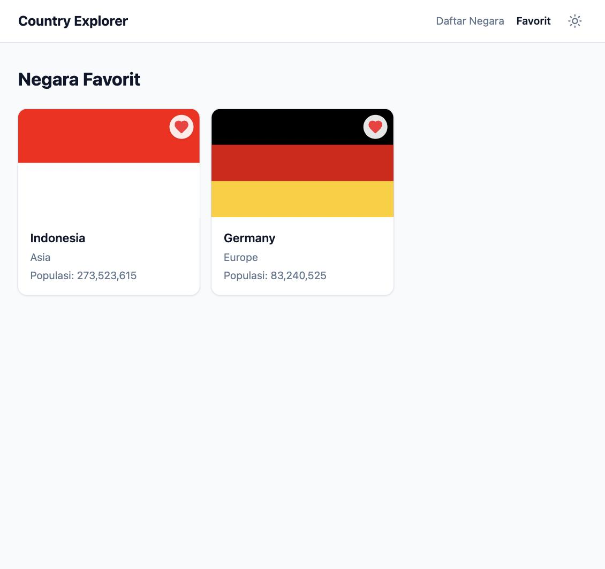
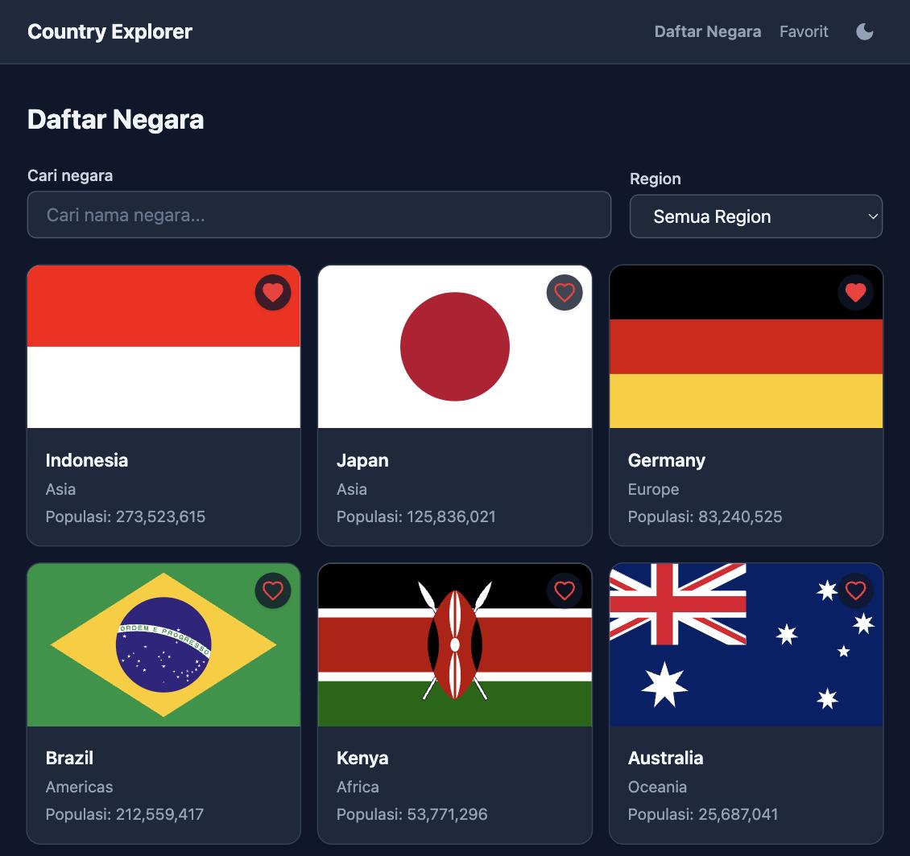

# Country Explorer

Aplikasi frontend untuk menjelajahi data negara-negara di dunia — cari berdasarkan nama, filter berdasarkan region, lihat detail lengkap tiap negara, dan simpan negara favorit. Dibangun dengan Angular 21 (standalone components, signals, zoneless) dan Tailwind CSS v4, murni frontend tanpa backend sendiri.

## Screenshot

| Daftar negara | Detail negara |
|---|---|
|  |  |

| Favorit | Dark mode |
|---|---|
|  |  |

## Fitur

- **Daftar negara** — card grid berisi bendera, nama, region, dan populasi
- **Search & filter** — cari berdasarkan nama (debounce 300ms) dan/atau filter berdasarkan region, keduanya bisa dipakai bersamaan
- **Detail negara** — bendera, nama resmi, ibu kota, populasi, luas wilayah, bahasa, mata uang, dan daftar negara perbatasan yang bisa diklik
- **Favorit** — toggle simpan/hapus favorit di tiap card, halaman khusus buat lihat semua favorit, tersimpan permanen di `localStorage`
- **Dark mode** — toggle manual di header, tersimpan di `localStorage`, default tetap light saat pertama kali dibuka
- **Responsive** — grid dan layout menyesuaikan dari mobile sampai desktop
- **Transisi halaman** — animasi fade singkat antar route pakai native View Transition API browser

## Tech stack

- **Angular 21** — standalone components, signals, zoneless change detection
- **TypeScript**
- **RxJS** — `debounceTime`, `distinctUntilChanged`, `switchMap`, `combineLatest`
- **Angular Router** — lazy-loaded routes, `withComponentInputBinding()`, `withViewTransitions()`
- **Tailwind CSS v4** — utility-first styling, dark mode via `class` strategy
- **REST Countries API v5** — sumber data negara
- **Karma + Jasmine** — unit testing

## Prasyarat

- Node.js `^22.22.3` atau `>=24.0.0` (dikembangkan dan diuji di Node 24.12)
- npm

## Setup

### 1. Install dependencies

```bash
npm install
```

### 2. Setup API key

Aplikasi ini konsumsi [REST Countries API v5](https://restcountries.com/). **Catatan penting**: versi lama API (v3.1) yang biasanya dipakai secara publik tanpa API key sudah dimatikan total per Agustus 2026 — semua endpoint-nya kini mengembalikan error deprecation. Versi penggantinya (v5) mewajibkan API key, meski tetap gratis untuk pemakaian personal/evaluasi.

1. Daftar gratis di https://restcountries.com/sign-up (tanpa kartu kredit, kuota 500 request/bulan)

2. Buat file konfigurasi lokal dengan **meng-copy** (bukan rename) template yang sudah tersedia di repo ini:

   ```bash
   cp src/environments/environment.keys.example.ts src/environments/environment.keys.ts
   ```

   File template `environment.keys.example.ts` **biarkan tetap ada** — itu file yang ikut ter-commit di repo, berfungsi sebagai contoh untuk siapapun yang clone project ini nantinya. File hasil copy, `environment.keys.ts`, sudah otomatis diabaikan git (lihat `.gitignore`), jadi aman diisi API key asli tanpa risiko ke-commit.

3. Buka `src/environments/environment.keys.ts` yang baru dibuat, lalu ganti isi `apiKey` dengan key asli kamu.

4. **Penting**: atur CORS allowed origins untuk key kamu:
   1. Buka https://restcountries.com/api-keys
   2. Klik tombol **Edit** pada key yang kamu pakai
   3. Di kolom CORS allowed origins, masukkan `localhost` (hostname polos — **tanpa** `http://` dan tanpa port)
   4. Simpan

   Tanpa langkah ini, request dari browser akan ditolak dengan error `"Origin is not allowed for this API key"` meski key-nya valid.

### 3. Jalankan dev server

```bash
npm start
```

Buka `http://localhost:4200/` di browser.

## Command reference

| Command | Keterangan |
|---|---|
| `npm start` | Jalankan dev server (`ng serve`) |
| `npm run build` | Build production ke folder `dist/` |
| `npm test` | Jalankan unit test (Karma + Jasmine) |

## Struktur project

```
src/app/
├── core/services/          # CountryService, FavoriteService, ThemeService
├── features/countries/     # Halaman: country-list, country-detail, country-favorites
├── shared/
│   ├── components/         # country-card, search-bar (reusable)
│   └── models/             # Country, LoadState
└── app.routes.ts
```

Setiap pemanggilan HTTP ke REST Countries API wajib lewat `CountryService` — komponen tidak pernah inject `HttpClient` langsung. Setiap halaman yang fetch data menangani 3 state secara eksplisit: loading, error, dan empty.

## Catatan teknis

- **Kenapa v5, bukan v3.1?** REST Countries v3.1 sudah dinonaktifkan total sejak Agustus 2026. Response mentah v5 juga berbeda jauh strukturnya dari v3.1 — `CountryService` yang memetakan shape v5 ke model `Country` yang lebih ringkas dan stabil, jadi seluruh komponen di app ini tidak pernah tahu soal detail response API mentah.
- **Kenapa perlu API key kalau katanya "public API"?** Itu benar untuk v3.1 (sudah mati). v5 mewajibkan `Authorization: Bearer <key>` di setiap request. Tidak ada cara lain untuk mengonsumsi data negara secara live tanpa key.
